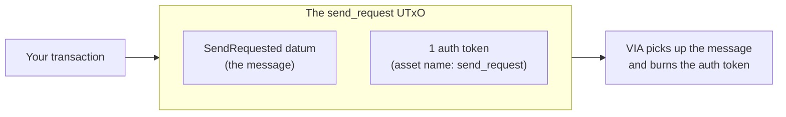

# Building on Cardano

This page covers building cross-chain dapps on Cardano. The VIA messaging layer moves data or value (tokens) between chains — and data means anything: news, sports results, numbers, text. Tokens are the most common case, not the only one.

The protocol is the same one you know from the [Technology Overview](/docs/general/technology-overview) — validators sign, relayers deliver, the destination verifies. What changes on Cardano is the execution model. This page explains the Cardano-specific concepts before you write any code.

:::info Mainnet and testnet
VIA is live on **Cardano Mainnet** (VIA chain ID `2273265`) and **Cardano Preprod** (`2273266`), with routes to Midnight and EVM networks. The examples on these pages use Preprod addresses; every deployed value differs per network — see [One Deployment Per Network](#one-deployment-per-network) below. Addresses are on [Supported Networks](/docs/general/supported-networks).
:::

---

## How Cardano Differs from EVM

Cardano uses the eUTxO model. There are no contracts with storage and no events. Instead, validators approve how UTxOs are spent, and minting policies approve how tokens are created or burned.

This changes how a VIA integration looks. One term first: on these pages, **your client** means your integration — the validator and minting policy you deploy.

| EVM | Cardano |
|-----|---------|
| Your contract inherits `ViaIntegrationV1` | Your client is a validator plus a minting policy |
| You call `messageSend()` | You produce a **send_request UTxO** |
| The gateway emits an event | The UTxO itself is the message |
| State lives in contract storage | Config lives in a state UTxO |

The key idea: **a message is a UTxO**. VIA's network watches for these UTxOs the same way it watches for gateway events on EVM chains.

---

## The Two-Stage Send

Sending a message takes two stages.

**Stage 1 — you create the request.** Your transaction produces a send_request UTxO. It carries two things: an inline datum of type `SendRequested`, and exactly one auth token whose asset name is `send_request`.



The datum inside the UTxO is the message itself:

```
SendRequested {
  sender: ScriptHash,      // your client validator
  recipient: ByteArray,    // the receiving contract on the destination chain
  dest_chain: Int,         // VIA chain ID of the destination
  chain_data: ByteArray,   // your payload — VILR for token transfers (next section)
  confirmations: Int,      // block confirmations to wait before relay
}
```

All five fields are mandatory. A send_request UTxO without a valid `SendRequested` datum is not a valid message.

**Stage 2 — VIA picks it up.** The validator network sees the UTxO, waits for the requested confirmations, and validates the message. When the message is processed, the auth token is burned. The burn is what guarantees each request is handled exactly once.

---

## The chain_data Format (VILR)

The `chain_data` field carries your payload. A custom shape is possible — see [Integration Paths](/docs/examples/cardano/integration-paths) — but VILR is the layout VIA is ready to handle today, and it is the standard for token transfers. It is a fixed byte layout that starts with the ASCII magic `VILR`. Fields are packed in order with no padding.

| Offset | Width (bytes) | Field | Description |
|--------|---------------|-------|-------------|
| 0 | 4 | `magic` | `0x56494C52` — ASCII "VILR" |
| 4 | 4 | `version` | Always `1` |
| 8 | 32 | `amount` | Token amount to transfer (uint256) |
| 40 | 32 | `source_token` | Token identity on the source chain (next section) |
| 72 | 4 | `source_depositor_prefix` | Reserved — must be `0` |
| 76 | 28 | `source_depositor` | Payment key hash of the depositor |
| 104 | 32 | `destination_token` | Token identity on the destination chain |
| 136 | 32 | `destination_recipient` | Recipient on the destination chain |
| 168 | 32 | `max_fee` | Fee cap for the transfer; `0` means no cap |
| 200 | 4 | `hook_data_len` | Length of `hook_data` in bytes |
| 204 | variable | `hook_data` | Optional payload for the recipient |

:::info hook_data on a Cardano destination
When Cardano is the destination chain, `hook_data` is enforced against the recipient output. Empty `hook_data` means the recipient output must carry `NoDatum`. Non-empty `hook_data` must equal the CBOR of the recipient output's inline datum.
:::

---

## Token Identity

Cardano tokens are identified by a policy ID and an asset name. Cross-chain, VIA needs one fixed-width identity. So a Cardano token's cross-chain identity is:

```
keccak256(policyId ++ assetName)
```

This 32-byte hash is what the EVM side sees as the Cardano token. It is also what you put in the `source_token` and `destination_token` fields.

`source_token`, `destination_token`, and `destination_recipient` are each **exactly 32 bytes**. No shorter, no longer. Addresses and identities smaller than 32 bytes are **left-padded** to fit.

---

## Routes: Which Senders You Accept

Your client does not accept messages from just anywhere. It holds an allowlist:

```
supported_routes: List<{source_chain: Int, sender: ByteArray}>
```

Each entry names a source chain and a specific sender on that chain. A message only passes if its origin matches an entry. This is the Cardano equivalent of `setMessageEndpoints()` on EVM — you decide which remote contracts you trust.

The list lives in an admin-updatable **state UTxO**, marked by a singleton NFT and read as a reference input. Because it is data, not code, you can add or remove routes without recompiling your validator.

---

## The Project Registry

Every VIA integration on Cardano must register a node in the on-chain project registry. When you register is your design choice — the reference burn & mint client does it at init, and a custom design can do it at any time. Details are on the [Integration Paths](/docs/examples/cardano/integration-paths) page.

---

## One Deployment Per Network

On EVM chains, the same contract bytecode can run on any network and read its configuration from storage. Cardano works the other way: a validator's parameters — the token it handles, the local chain id, the policy ids it trusts — are **applied at compile time and baked into the script bytes**. Change a parameter and you have a different script, with a different hash, and therefore a different address and policy id.

So "the same contract on mainnet and testnet" still means **different bytes, different hashes, different addresses** — and since hashes are how everything on Cardano references everything (lane tokens, routing targets, reference-script lookups), no value from one network resolves on the other. The USDM lock-release client illustrates it:

| | Preprod | Mainnet |
|---|---------|---------|
| VIA chain id (baked in) | `2273266` | `2273265` |
| Locked asset (baked in) | tUSDM `e675b46e…` | USDM `c48cbb3d…` |
| Resulting client policy id | `76fbe9f6…` | `f8fe0d08…` |

Deployments ship as a per-network manifest that carries each protocol script's final compiled form **plus the UTxO where it is published as a reference script**, so transactions reference the on-chain copy instead of attaching kilobytes of script — and consumers never hunt for references through an indexer.

One more per-network value: the confirmations validators wait for before attesting a message — **1 block on Preprod, 150 on Mainnet**.

---

## What You Build, What VIA Provides

VIA's protocol validators are deployed on-chain, and the off-chain network watches send_request UTxOs around the clock. You do not deploy or run any of that.

**You build, deploy, and register:**

- Your client validator and minting policy
- Your state UTxO configuration — routes, admin keys

**VIA provides:**

- The network data values your client needs, like the protocol policy IDs
- Message-layer support for your integration, so your messages get processed

Launching your own cross-chain token on Cardano or Midnight is a guided process: you build and deploy, and VIA wires your integration into the message layer. Bridging tokens VIA already supports, like **USDM**, needs no onboarding at all — that path is permissionless.

Expect protocol fees of a few ADA per message on each chain, plus normal network fees.

---

## Next Steps

- [Integration Paths](/docs/examples/cardano/integration-paths) — out-of-box vs custom, and how onboarding works
- [Burn & Mint Client](/docs/examples/cardano/mint-burn-client) — the reference client validator, piece by piece
- [Lock & Release Client](/docs/examples/cardano/lock-release-client) — the vault client for pre-existing tokens
- [USDM: Cardano ↔ Midnight](/docs/examples/guides/usdm-cardano-midnight) — bridge USDM today, no onboarding required
