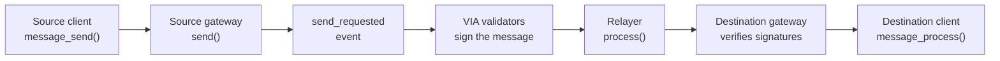

# Building on Stellar

This page covers building cross-chain dapps on Stellar. VIA is not a bridge — it is a cross-chain messaging network. The messaging layer moves data or value (tokens) between chains, and data means anything: prices, results, numbers, text. Token transfers, and bridges themselves, are applications you build on top of it.

The protocol is the same one you know from the [Technology Overview](/docs/general/technology-overview) — validators sign, relayers deliver, the destination verifies. What changes on Stellar is the contract model: Soroban contracts written in Rust. This page explains the Stellar-specific concepts before you write any code.

:::info Mainnet and testnet
VIA is live on **Stellar mainnet** (VIA chain ID `5731147`) and **Stellar testnet** (`5555555555555555`), with routes to Ethereum mainnet and Ethereum Sepolia. Every deployed value differs per network — see [Deployed Contracts](#deployed-contracts) below. Gateway addresses are also on [Supported Networks](/docs/general/supported-networks).
:::

The live reference integration is VIAT, a test token that transfers in both directions between Stellar and Ethereum. You can try it in the [VIAT transfer app](https://stellar.anytoany.xyz/). This page covers how a Stellar client works.

---

## How Stellar Differs from EVM

Stellar smart contracts run on Soroban and are written in Rust. Like an EVM contract, a Soroban contract has storage, emits events, and calls other contracts. So a VIA integration on Stellar looks close to the EVM shape, with Rust idioms in place of Solidity ones. One term first: on these pages, **your client** means your integration — the Soroban contract you deploy.

| EVM | Stellar |
|-----|---------|
| Your contract inherits `ViaIntegrationV1` | Your client uses the `message-client` crate and its `#[default_impl]` macro |
| You call `messageSend()` | You call `message_send()` |
| You override `messageProcess()` | You implement `message_process()` |
| Addresses are 20 bytes | Accounts and contracts are 32-byte IDs |
| Validators sign with ECDSA | Validators sign with ed25519 |
| Tokens use 18 decimals | Tokens use 7 decimals |

One rule has no EVM counterpart: **only a contract can send a message.** The gateway rejects calls that come straight from a wallet. A user interacts with your client, and your client calls the gateway.

---

## The Message Flow

Sending and receiving follow the same steps as every VIA chain. Here is where each step runs on Stellar.

**Send.** Your client calls `message_send()` with the destination chain ID and a payload. The crate looks up the endpoint you registered for that chain and calls `send()` on the VIA gateway. The gateway assigns a message ID and emits a `send_requested` event. Your client's own address is the sender: the crate fills it in, and the gateway requires that contract's authorization, so nobody can spoof it.

**Validate and sign.** VIA's validator network watches the gateway for `send_requested` events. Each validator re-reads the message from the source chain, then signs its hash with an ed25519 key.

**Deliver.** A relayer submits `process()` to the gateway on the destination chain. The gateway checks that the relayer is authorized, that the message ID was not processed before, and that the signatures meet the configured thresholds. Then it invokes `message_process_from_gateway()` on your client.

**Receive.** The crate checks that the call came from the gateway and that the sender matches the endpoint you registered for the source chain. Then it runs your `message_process()`.



Both directions work the same way. A message from Ethereum to Stellar ends with the Stellar gateway verifying ed25519 signatures and calling your client.

---

## Endpoints and Identity

Your client accepts messages only from senders you register. The registry is keyed by VIA chain ID:

```rust
set_message_endpoints(chains: Vec<u64>, endpoints: Vec<Bytes>)
get_endpoint_by_chain_id(chain_id: u64) -> Bytes
```

Each endpoint is the counterpart contract on another chain, in a fixed 32-byte form:

- **An EVM contract** is its 20-byte address, left-padded with zeros to 32 bytes.
- **A Stellar contract** is its raw 32-byte contract ID — the last 32 bytes of the address's XDR encoding. The `C...` string you see in wallets and explorers is the same value, base32-encoded with a checksum.

The same 32-byte form is what the far side sees. On EVM, non-EVM identities travel as `bytes32`, so your Stellar client appears there as its 32-byte contract ID. Register it with `setMessageEndpoints()` on the EVM contract, and register the EVM contract's padded address on your Stellar client. Only the owner of your client can change endpoints.

This is the Stellar equivalent of `setMessageEndpoints()` on EVM — you decide which remote contracts you trust.

---

## Payloads

The payload you pass to `message_send()` is opaque bytes. The `message-client` crate ships an `abi` module that encodes and decodes in the same format as Solidity's `abi.encode`, so a Stellar client and an EVM contract can share one payload layout without a translation step.

The reference token client encodes three fields:

```rust
let values = [
    AbiValue::Bytes(recipient),   // recipient on the destination chain
    AbiValue::I128(amount),       // amount, 18 decimals on the wire
    AbiValue::Bytes(text),        // optional memo
];
let chain_data = abi_encode(env, &values);
```

Two conventions to keep across chains:

- **Amounts travel as 18 decimals.** Stellar tokens use 7 decimals. The reference client scales up by 10^11 when it sends and scales down when it receives, so 5 tokens on Stellar arrive as 5 tokens on Ethereum.
- **Recipients travel as raw 32-byte IDs.** When Ethereum sends to Stellar, the recipient field is the Stellar account or contract ID. VIA's message layer restores the full Stellar address before delivery.

:::warning Fund the recipient first
A Stellar account must exist on the ledger before it can receive a transfer. Fund it with the minimum XLM balance before you send to it. An unfunded account looks like a contract ID to the message layer, and tokens delivered to it are not recoverable.
:::

---

## Message IDs

Every message carries a 128-bit ID. The gateway builds it from the VIA chain ID and a counter:

```
message_id = chain_id × 10^23 + counter
```

So a message that starts on Stellar mainnet has an ID that starts with `5731147`. Use the ID to follow a message on [VIA Scan](https://scan.vialabs.tech).

---

## Signatures and Security Layers

The Stellar gateway verifies signatures on-chain, in the same three-layer model as EVM — VIA layer, chain layer, project layer. Each layer is a set of Stellar account keys (`G...`) with its own threshold. Validators sign the keccak-256 hash of the encoded message with ed25519, and the gateway checks every signature against the configured signer sets before it calls your client.

Your client can add its own project layer. Call `set_project_signers()` with your signer keys and the number of signatures you require. From then on, no message reaches your client without your signers' approval, in addition to VIA's. See the [Security Model](/docs/general/technology-overview#security-model) for how the layers combine.

Relayers run from an allowlist on the gateway. Your client can restrict delivery to its own relayers with `set_contract_relayers()`.

---

## Fees

Every Stellar transaction pays network fees in XLM, including the call that starts a transfer. The gateway also supports a protocol fee handler. No VIA protocol fee is charged on Stellar routes during the launch period, so a message costs Stellar network fees only.

Relayers pay the destination-side fees when they deliver a message. See [Fees & Gas](/docs/general/fees-and-gas) for the model on every chain.

---

## Deployed Contracts

Each network has one VIA gateway and one VIAT reference token. The Ethereum side of a Stellar route uses the gateways in these tables.

| | Stellar mainnet | Ethereum mainnet |
|---|---|---|
| VIA chain ID | `5731147` | `1` |
| Gateway | `CB4TJPBTN6L72FGJLL2ZQHMKUZVSETA4N7HO6KFM4I27MMVOJ2UUEEWL` | `0xDaA038AdB967A9aF11570D13Af8D723007EEf7eC` |
| VIAT token | `CCV4X6S5TM4IVWIIWMLK6S5J3M34B64RJTLD5TF6QKDGVJKYFZQWJ3OV` | `0x64F47B4A956DAFF307333F6A99DDB70beC9144E6` |

| | Stellar testnet | Ethereum Sepolia |
|---|---|---|
| VIA chain ID | `5555555555555555` | `11155111` |
| Gateway | `CDCMBYICTWZS3CYNPOCIATFK4JRX36KTLQUERWRBOQDZWLKH2YDGP32N` | `0xaA6917086C29beFBd2e918E2B7E657Cec8A5E674` |
| VIAT token | `CCCIGW2URB5RDLE3AMOJ2RCOX2SM6YEWR4KAEMYWT5ECERDIMZQX3H2R` | `0xc544645964C6D013D68189B8922Ce0B69e7BEe0c` |

The Stellar contracts are the VG1 Stellar contracts audited by Hashlock — see [Audits](/docs/general/audits). Stellar finalizes in about five seconds, so the reference client requests zero confirmations. The validator's polling interval sets the delivery time: observed transfers complete in one to three minutes in each direction.

---

## Toolchain

The reference contracts build with these versions:

| Component | Version |
|---|---|
| `soroban-sdk` | 23.5.2 |
| OpenZeppelin Stellar contracts (`stellar-tokens`, `stellar-access`, `stellar-macros`) | 0.6.0 |
| `message-client` | 0.4.0 |
| Rust target | `wasm32v1-none` |

The workspace builds every contract to `target/wasm32v1-none/release/`. Deploy the `.wasm` with the Stellar CLI. For the Soroban toolchain itself, see the [Stellar developer documentation](https://developers.stellar.org/).

---

## What You Build, What VIA Provides

VIA's gateway is deployed on-chain, and the validator network watches it around the clock. You do not deploy or run any of that.

**You build, deploy, and configure:**

- Your client contract — the `message-client` crate plus your own logic
- Its configuration — the gateway address and the endpoints you trust, set by your owner key

**VIA provides:**

- The gateway address and VIA chain ID for each network
- Message-layer support for your routes, so your messages get processed

Launching your own cross-chain token on Stellar is a guided process: you build and deploy, and VIA wires your integration into the message layer. Transferring VIAT through the deployed contracts needs no onboarding.

---

## Next Steps

- [Integration Paths](/docs/examples/stellar/integration-paths) — reference client as shipped versus custom logic, and how onboarding works
- [Burn & Mint Client](/docs/examples/stellar/mint-burn-client) — the reference token client, piece by piece
- [Audits](/docs/general/audits) — what has been audited and by whom
