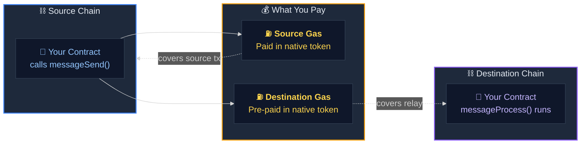
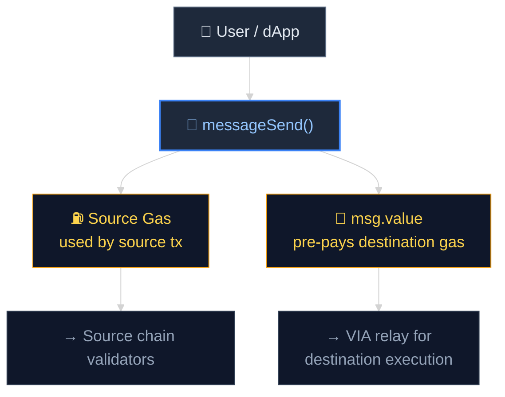

# Fees & Gas

Understanding the cost structure for cross-chain messaging with VIA Labs.

---

## Overview

VIA Labs charges **no protocol fee**. There is no fixed USDC charge, no subscription, and no token requirement. You only pay the native gas costs of the blockchains you use.

---

## Two-Cost Structure

Every cross-chain message incurs exactly **two gas costs**, both paid in the source chain's native token at the time of sending.

### 1. Source Chain Gas

The standard gas cost of executing your `messageSend()` transaction on the originating chain.

- Paid by the **user or calling contract** as part of the normal transaction
- Denominated in the **source chain's native token** (ETH, MATIC, AVAX, BNB, etc.)
- Varies based on payload size and source chain gas prices

### 2. Destination Chain Gas

The gas cost of executing the relay transaction on the destination chain, estimated and collected upfront.

- Included as `msg.value` in the `messageSend()` call
- Denominated in the **source chain's native token** (automatically converted)
- Covers the validator's cost of calling the Gateway contract on the destination chain

---

## What Affects Cost

| Factor | Impact |
|--------|--------|
| **Payload size** | Larger `bytes` payloads cost more gas to encode and decode |
| **Source chain gas price** | High-traffic chains (Ethereum mainnet) cost more than L2s |
| **Destination chain gas price** | Affects the `msg.value` required for relay execution |
| **Destination chain congestion** | Spikes in destination gas prices may increase relay cost |
| **Contract logic complexity** | More complex `messageProcess()` logic uses more destination gas |

---

## No Hidden Fees

| | VIA Labs | Traditional Bridges |
|---|---|---|
| **Protocol fee** | None | Often 0.1–0.5% of value |
| **Token requirement** | None | Many require holding/staking a protocol token |
| **Payment currency** | Source chain native gas only | Often requires specific tokens (USDC, protocol token) |
| **Subscription** | None | Some charge monthly/annual fees |

---

## Fee Estimation

Gas estimates are calculated automatically when you call `messageSend()`. The function will revert if insufficient `msg.value` is provided to cover destination gas.

:::tip
For testnet development, fees are negligible. Use testnet faucets to get free tokens — see [Testnet Tokens](/docs/general/testnet-tokens).
:::

---

## Testnet Usage

Testnet transactions use testnet tokens and are effectively free. See [Testnet Tokens](/docs/general/testnet-tokens) for faucet links.
