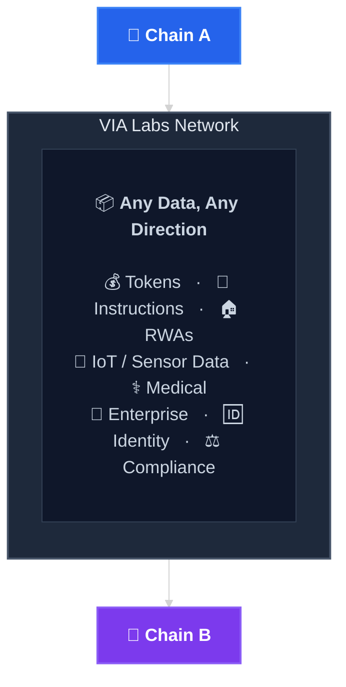
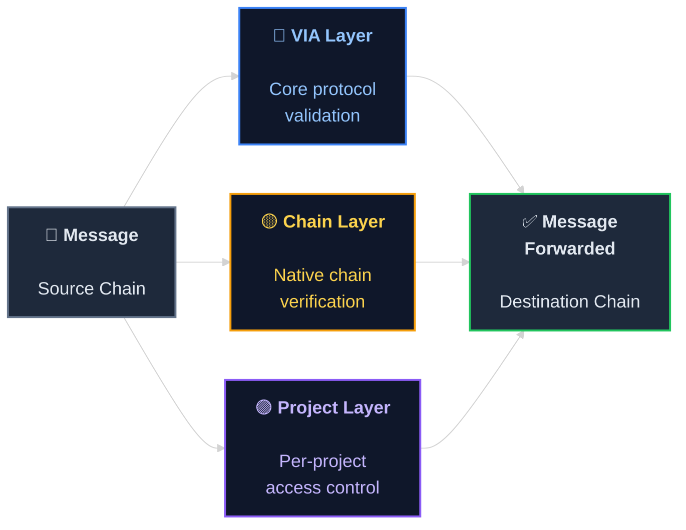

# Diagram Backup — Technology Overview

This file preserves the original Mermaid diagrams for reversion if needed.

## Big Picture Diagram

```mermaid
%%{init: {'theme': 'dark', 'themeVariables': {'fontSize': '18px'}}}%%
flowchart TB
    A["🔗 <b>Chain A</b>"]

    subgraph VIA["  VIA Labs Network  "]
        direction TB
        M["<br/>📦 <b>Any Data, Any Direction</b><br/><br/>💰 Tokens &nbsp; · &nbsp; 📜 Instructions &nbsp; · &nbsp; 🏠 RWAs<br/>📡 IoT / Sensor Data &nbsp; · &nbsp; ⚕️ Medical<br/>🏢 Enterprise &nbsp; · &nbsp; 🆔 Identity &nbsp; · &nbsp; ⚖️ Compliance<br/><br/>"]
    end

    B["🔗 <b>Chain B</b>"]

    A --> VIA --> B

    style A fill:#2563eb,stroke:#3b82f6,stroke-width:2px,color:#ffffff
    style B fill:#7c3aed,stroke:#8b5cf6,stroke-width:2px,color:#ffffff
    style VIA fill:#1e293b,stroke:#475569,stroke-width:2px,color:#e2e8f0
    style M fill:#0f172a,stroke:#334155,stroke-width:1px,color:#cbd5e1
```

## How It Works Diagram

```mermaid
%%{init: {'theme': 'dark', 'themeVariables': {'fontSize': '18px'}}}%%
flowchart LR
    subgraph S["⛓️ Source Chain"]
        S1["📝 Your Contract"] --> S2["🌐 VIA Gateway"]
    end

    subgraph V["🔒 Validators"]
        V1["👁️ Detect"] --> V2["✍️ Sign"]
    end

    subgraph D["⛓️ Destination Chain"]
        D1["🌐 VIA Gateway"] --> D2["📝 Your Contract"]
    end

    S2 -- "Event" --> V1
    V2 -- "Relay" --> D1

    style S fill:#1e293b,stroke:#3b82f6,stroke-width:2px,color:#e2e8f0
    style V fill:#1e293b,stroke:#f59e0b,stroke-width:2px,color:#e2e8f0
    style D fill:#1e293b,stroke:#8b5cf6,stroke-width:2px,color:#e2e8f0
    style S1 fill:#0f172a,stroke:#334155,color:#93c5fd
    style S2 fill:#0f172a,stroke:#334155,color:#93c5fd
    style V1 fill:#0f172a,stroke:#334155,color:#fcd34d
    style V2 fill:#0f172a,stroke:#334155,color:#fcd34d
    style D1 fill:#0f172a,stroke:#334155,color:#c4b5fd
    style D2 fill:#0f172a,stroke:#334155,color:#c4b5fd
```

## Security Model Diagram

```mermaid
%%{init: {'theme': 'dark', 'themeVariables': {'fontSize': '18px'}}}%%
flowchart LR
    MSG_IN["📨 <b>Message</b><br/><br/>Source Chain"]

    VIA["🔵 <b>VIA Layer</b><br/><br/>Core protocol<br/>validation"]
    CHAIN["🟡 <b>Chain Layer</b><br/><br/>Native chain<br/>verification"]
    PROJECT["🟣 <b>Project Layer</b><br/><br/>Per-project<br/>access control"]

    MSG_OUT["✅ <b>Message<br/>Forwarded</b><br/><br/>Destination Chain"]

    MSG_IN --> VIA
    MSG_IN --> CHAIN
    MSG_IN --> PROJECT

    VIA --> MSG_OUT
    CHAIN --> MSG_OUT
    PROJECT --> MSG_OUT

    style MSG_IN fill:#1e293b,stroke:#64748b,stroke-width:2px,color:#e2e8f0
    style MSG_OUT fill:#1e293b,stroke:#22c55e,stroke-width:2px,color:#e2e8f0
    style VIA fill:#0f172a,stroke:#3b82f6,stroke-width:2px,color:#93c5fd
    style CHAIN fill:#0f172a,stroke:#f59e0b,stroke-width:2px,color:#fcd34d
    style PROJECT fill:#0f172a,stroke:#8b5cf6,stroke-width:2px,color:#c4b5fd
```
