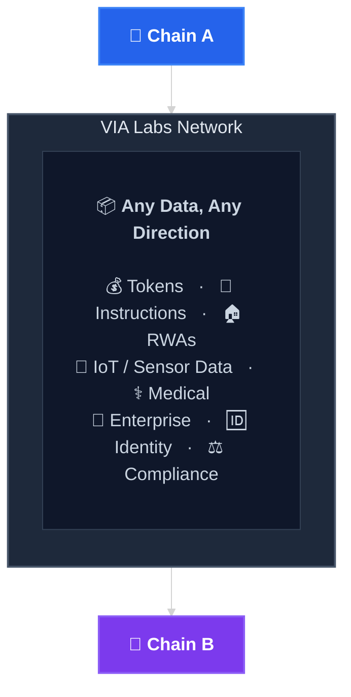
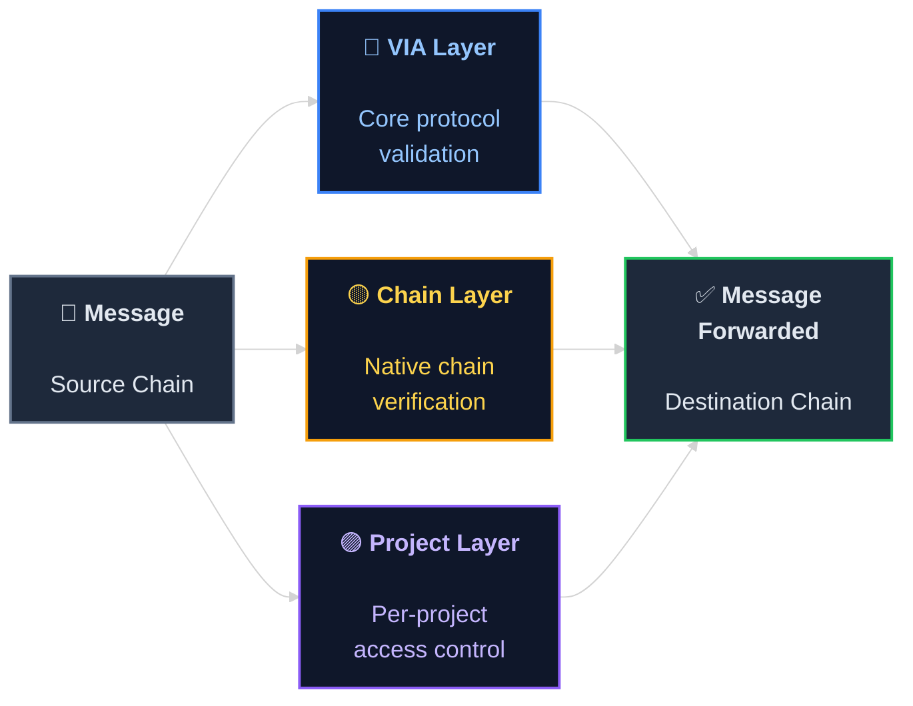

# Technology Overview

VIA Labs enables **direct cross-chain smart contract communication** without traditional bridges. Messages flow securely between chains using a multi-layered validation protocol powered by **VG-1 (VIA Gateway 1)**, our production infrastructure for cross-chain message routing.

---

## The Big Picture

At its core, VIA Labs connects smart contracts on any blockchain to smart contracts on any other blockchain. A message sent from Chain A arrives on Chain B — carrying whatever payload your application needs.

Any data that can be encoded can be sent cross-chain: token transfers, governance instructions, IoT sensor readings, medical records, enterprise system events, or real-world asset attestations.

---

## Architecture

VIA Labs uses a decentralized network of off-chain validator nodes to relay messages between blockchains. The system is designed for:

- **Security** — Three independent validation layers verify every message before execution
- **Speed** — Messages are delivered as fast as the destination chain's finality allows
- **Flexibility** — Support for arbitrary message passing, not just token transfers
- **Universality** — 140+ EVM and non-EVM chains supported from a single integration

---

## How It Works

Cross-chain messaging follows four steps:

1. **Your contract calls `messageSend()`** — encodes the payload and specifies the destination chain
2. **Validators detect the event** — listening across all configured chains via a P2P network
3. **Signatures are collected and verified** — all three security layers sign off
4. **The destination Gateway executes** — calls `messageProcess()` on your recipient contract

```mermaid
%%{init: {'theme': 'dark', 'themeVariables': {'fontSize': '18px'}}}%%
flowchart LR
    subgraph S["⛓️ Source Chain"]
        S1["📝 Your Contract"] --> S2["🌐 VIA Gateway"]
    end

    subgraph V["🔒 Validators"]
        V1["👁️ Detect"] --> V2["✍️ Sign"]
    end

    subgraph D["⛓️ Destination Chain"]
        D1["🌐 VIA Gateway"] --> D2["📝 Your Contract"]
    end

    S2 -- "Event" --> V1
    V2 -- "Relay" --> D1

    style S fill:#1e293b,stroke:#3b82f6,stroke-width:2px,color:#e2e8f0
    style V fill:#1e293b,stroke:#f59e0b,stroke-width:2px,color:#e2e8f0
    style D fill:#1e293b,stroke:#8b5cf6,stroke-width:2px,color:#e2e8f0
    style S1 fill:#0f172a,stroke:#334155,color:#93c5fd
    style S2 fill:#0f172a,stroke:#334155,color:#93c5fd
    style V1 fill:#0f172a,stroke:#334155,color:#fcd34d
    style V2 fill:#0f172a,stroke:#334155,color:#fcd34d
    style D1 fill:#0f172a,stroke:#334155,color:#c4b5fd
    style D2 fill:#0f172a,stroke:#334155,color:#c4b5fd
```

---

## Security Model

VIA Labs implements a **three-layer security model**. Every cross-chain message must pass through all three independent validation layers before it is executed on the destination chain. No single layer can authorize a message alone.

| Layer | Role | What It Validates |
|-------|------|-------------------|
| **VIA Layer** | Core protocol validation | Signature authenticity, message integrity, and relay authorization by the VIA network |
| **Chain Layer** | Native chain verification | Source chain finality, transaction inclusion, and on-chain event confirmation |
| **Project Layer** | Per-project access control | Whitelisted contracts, allowed chains, and project-specific security policies |

All three signatures are verified **on-chain** by the destination Gateway contract before the message is forwarded to the recipient.

---

## Use Cases

VIA Labs cross-chain messaging is designed for production-grade, enterprise applications across regulated and institutional environments.

### Financial Infrastructure

| Use Case | Description |
|----------|-------------|
| **Tokenized Equities** | Issue equity tokens on one chain and enable compliant trading and settlement across multiple networks |
| **Cross-Chain Stablecoins** | Move stablecoins between chains natively without wrapping, maintaining 1:1 backing guarantees |
| **Multi-Chain Treasury Management** | Manage corporate or DAO treasuries across chains with unified governance and reporting |
| **Cross-Border Settlement** | Accelerate cross-border payment settlement by routing transactions across chain-specific corridors |

### Real-World Assets (RWAs)

| Use Case | Description |
|----------|-------------|
| **Tokenized Real Estate** | Fractionalize property ownership on one chain and enable secondary trading on others |
| **Supply Chain Finance** | Track and transfer tokenized invoices and trade finance instruments across chains |
| **Carbon Credit Markets** | Issue, transfer, and retire carbon credits across multiple registries and chains |
| **Commodities Trading** | Enable cross-chain delivery-vs-payment for tokenized commodity contracts |

### Enterprise Integration

| Use Case | Description |
|----------|-------------|
| **Private Oracles** | Connect proprietary data feeds, internal APIs, or off-chain computation to smart contracts on any chain |
| **Cross-Chain Identity** | Propagate KYC/AML attestations across chains without re-verification |
| **Multi-Chain Governance** | Execute DAO proposals and voting across all chains where token holders reside |
| **Regulatory Reporting** | Aggregate on-chain activity across networks into a single compliance data stream |
